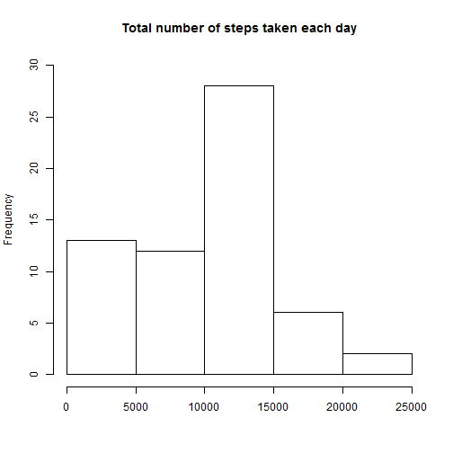
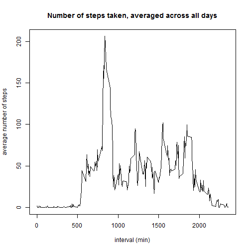
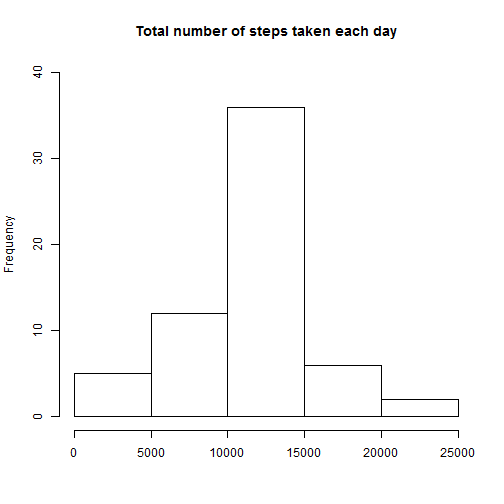
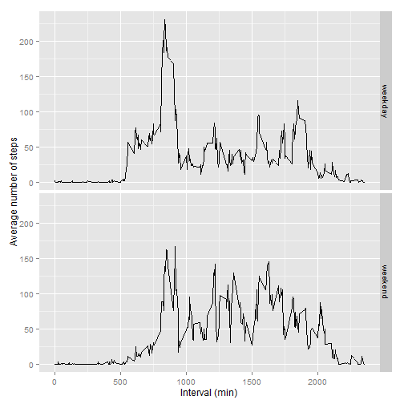

# Report on data from personal activity monitoring device


### Loading and preprocessing the data


```r
activity <- read.csv("activity.csv", header=T)
activity$date <- as.Date(activity$date)
```


### What is mean total number of steps taken per day?

Total number of steps taken per day


```r
q1 <- aggregate(activity$steps, by=list(activity$date), FUN=sum, na.rm=T)
colnames(q1) <- c("date","sum_of_steps")

hist(q1$sum_of_steps, main="Total number of steps taken each day", ylim=c(0,30), xlab="")
```

 

Mean and median of the total number of steps taken per day


```r
mean(q1$sum_of_steps)
```

```
## [1] 9354.23
```

```r
median(q1$sum_of_steps)
```

```
## [1] 10395
```


### What is the average daily activity pattern?

Time series plot 


```r
q2 <- round(aggregate(activity$steps, by=list(activity$interval), FUN=mean, na.rm=T),3)
colnames(q2) <- c("interval_min","avg_steps")

plot(q2$interval_min, q2$avg_steps, type="l", main="Number of steps taken, averaged across all days", xlab="interval (min)", ylab="average number of steps")
```

 

Which 5-minute interval, on average across all the days in the dataset, contains the maximum number of steps?


```r
q2[q2$avg_steps==max(q2$avg_steps),]
```

```
##     interval_min avg_steps
## 104          835    206.17
```


### Imputing missing values

Total number of missing values in the dataset


```r
length(activity$steps[is.na(activity$steps)])
```

```
## [1] 2304
```

Filling in all of the missing values in the dataset (using **mean for a 5-minute interval**) and creating a new dataset that is equal to the original dataset but with the missing data filled in.


```r
activity2 <- activity

for (i in 1:nrow(activity2)) {
    if (is.na(activity2$steps[i])) {
        activity2$steps[i] <- q2$avg_steps[which(q2$interval_min==activity2$interval[i])]
    }
}
```

Total number of steps taken per day (dataset with the filled-in missing values)


```r
q3 <- aggregate(activity2$steps, by=list(activity2$date), FUN=sum)
colnames(q3) <- c("date","sum_of_steps")

hist(q3$sum_of_steps, main="Total number of steps taken each day", ylim=c(0,40), xlab="")
```

 

Mean and median of the total number of steps taken per day (dataset with the filled-in missing values)


```r
mean(q3$sum_of_steps)
```

```
## [1] 10766.19
```

```r
median(q3$sum_of_steps)
```

```
## [1] 10766.19
```


### Are there differences in activity patterns between weekdays and weekends?

New factor variable in the dataset with two levels – “weekday” and “weekend” indicating whether a given date is a weekday or weekend day


```r
for (j in 1:nrow(activity2)) {
    activity2$weekday[j] <- weekdays(activity2$date[j])
}

activity2$weekday[activity2$weekday=="poniedzia³ek"] <- "weekday"
activity2$weekday[activity2$weekday=="wtorek"] <- "weekday"
activity2$weekday[activity2$weekday=="œroda"] <- "weekday"
activity2$weekday[activity2$weekday=="czwartek"] <- "weekday"
activity2$weekday[activity2$weekday=="pi¹tek"] <- "weekday"
activity2$weekday[activity2$weekday=="sobota"] <- "weekend"
activity2$weekday[activity2$weekday=="niedziela"] <- "weekend"
```

Panel plot containing a time series plot of the 5-minute interval (x-axis) and the average number of steps taken, averaged across all weekday days or weekend days (y-axis)


```r
activity2$weekday <- as.numeric(as.factor(activity2$weekday))

q4 <- aggregate(activity2$steps, by=list(activity2$interval,activity2$weekday), FUN=mean)
colnames(q4) <- c("interval_min","day","avg_steps")

q4$day[q4$day==1] <- "weekday"
q4$day[q4$day==2] <- "weekend"

library(ggplot2)

qplot(interval_min,avg_steps,data=q4,stat="identity", facets=day~., geom="line", ylab="Average number of steps", xlab="Interval (min)")
```

 
